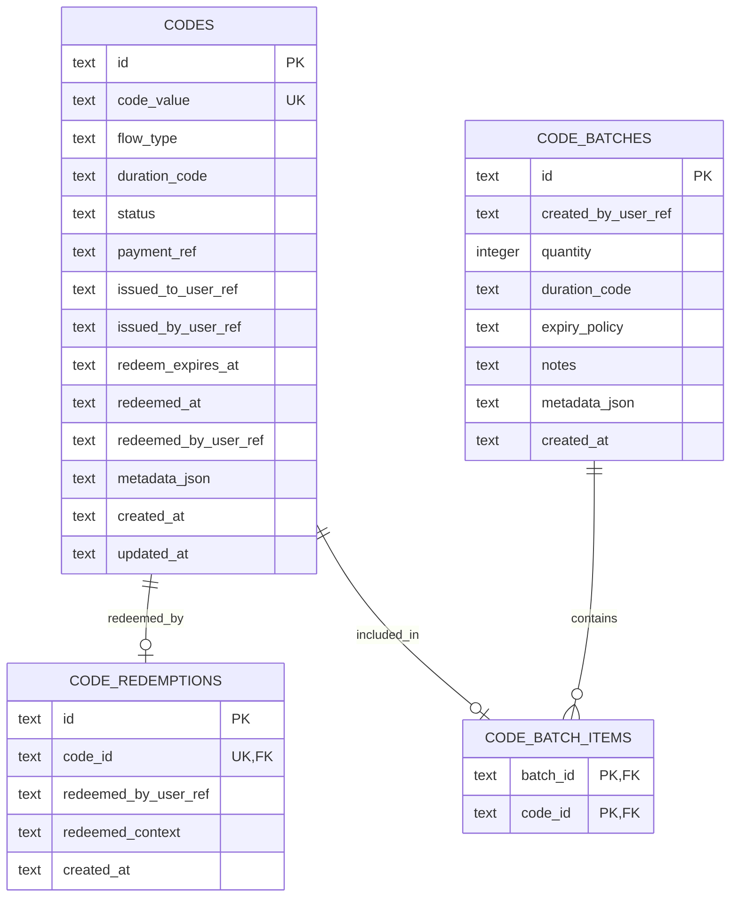

# D1 Schema Explained

This document explains the reduced Cloudflare D1 schema and shows the entity relationships as an ERD.

## Boundary

D1 is intentionally limited to code-related persistence.

The backend server owns:
- users
- user roles
- pricing
- country mapping / country resolution
- payment state
- auth/session state
- operational controls such as idempotency, audit, and rate limiting

D1 stores only:
- issued codes
- redemption events
- bulk code batches

## Plain-English Overview

### `codes`
- One row per issued subscription code.
- Stores the actual signed code value plus business state:
  - flow type
  - duration
  - status
  - payment reference
  - who issued it / who received it / who redeemed it
  - optional redemption expiry
  - optional metadata blob

Important detail:
- user references are stored as plain text IDs from the backend system, not as D1 foreign keys.

### `code_redemptions`
- One redemption event per code.
- `code_id` is unique, which enforces one-time redemption at the database layer.
- Can also store who redeemed it and some optional context.

### `code_batches`
- Used for bulk printed-card generation.
- Tracks who created the batch, how many codes it should contain, which duration it represents, expiry policy, notes, and metadata.

### `code_batch_items`
- Join table connecting a batch to the codes created inside that batch.
- A batch can contain many codes.
- Each code can belong to at most one batch in this schema.

## Relationship Summary

- A `code` can have at most one `code_redemptions` row.
- A `code_batch` can contain many codes through `code_batch_items`.
- User data is not normalized in D1; it is referenced by backend-managed string IDs.

## ERD

## Practical Read

- `codes` is the main product table.
- `code_redemptions` is the one-time activation record.
- `code_batches` and `code_batch_items` support printed-card or bulk issuance workflows.
- Everything about users, roles, pricing, country, and payment lifecycle lives outside D1 in the backend server.

## Current Repo Gap

This schema reflects the desired storage boundary, but the current Worker implementation in `backend/worker.mjs` still keeps code state in memory. D1 is configured but not yet used by the Worker.
